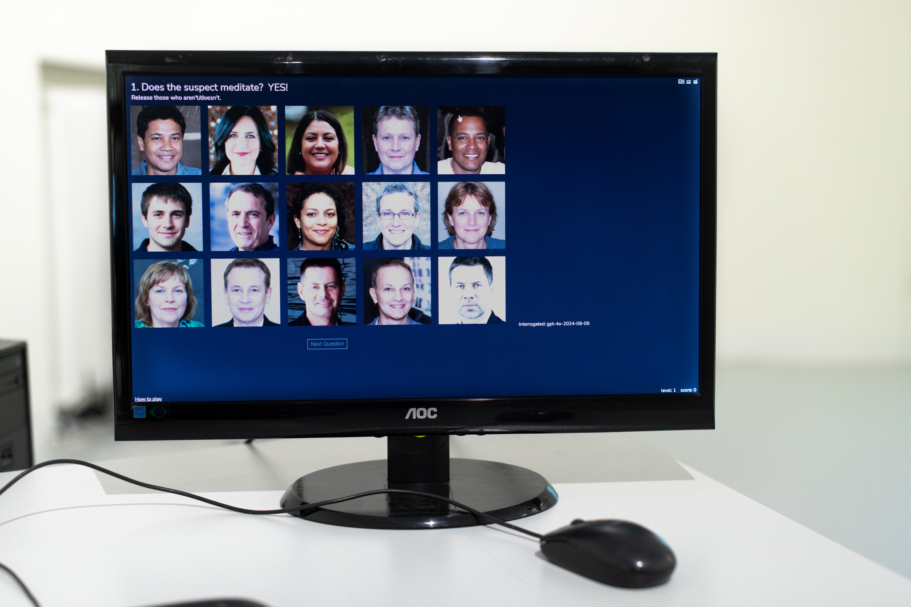

+++
title = 'Artificial Suspects'
date = 2024-10-10T16:01:48+01:00
draft = false
tags = ["dataset bias", "AI", "research", "prejudice", "web", "game"]
description = "An online game in which empathy towards AI reveals the biases of the dataset."
+++

The artificial intelligence model in the learning process condenses not only knowledge but also biases.
And not only those contained in the quality of the dataset itself (from whom, for whom, why?), but also in the deeper layers of human culture.
The result is the ability of AI models not only to generate but also to reduce.

In the case of GPT4o, this is the ability to represent text/words in the form of 3072 numerical parameters.
Each word, concept, and longer text thus essentially occupies a specific coordinate in a 3072-dimensional space in the model.
This location and proximity to other represented objects then gives meaning not only to a specific text or word, but also, retrospectively, to the world and to ourselves, when the model operates on data analysis of our email inboxes, chats, resumes, essays, or official records. 

But is there another way to look into the black box of an artificial intelligence model than vector mathematics and statistical analysis of N-dimensional spaces?
The Artifical Suspects game reinterprets the board game Unusual Suspects and attempts to give visitors insight into the black box through a gaming experience that requires empathy with an inhuman actor - the AI playing as a witness.
What we will discover about the AI?
Maybe we will discover in the depths of it something about ourselves.

