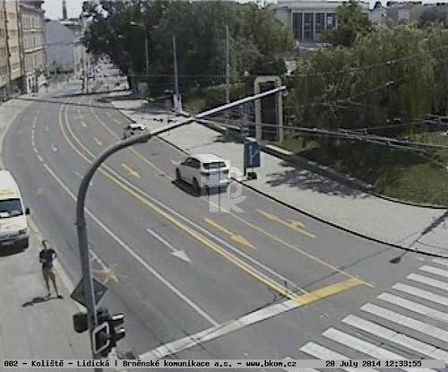
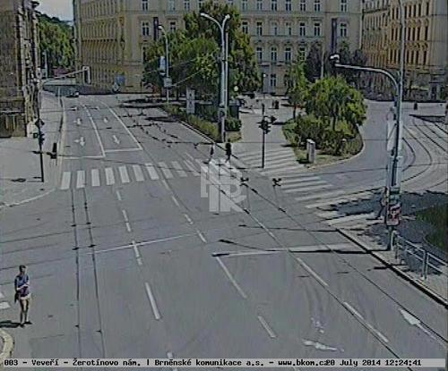
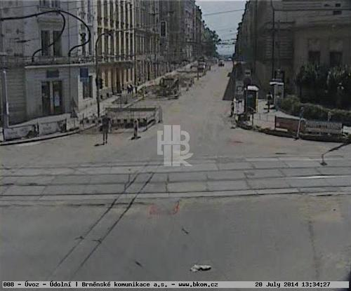
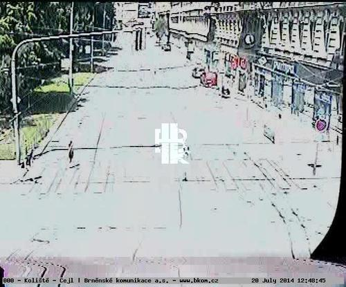
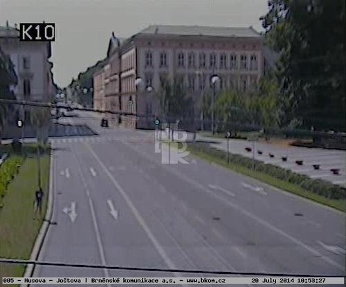
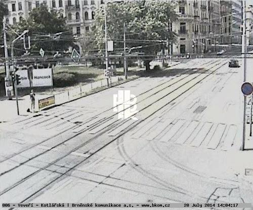
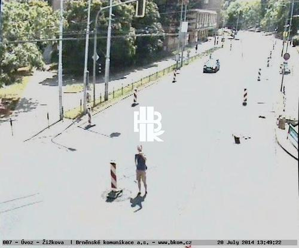
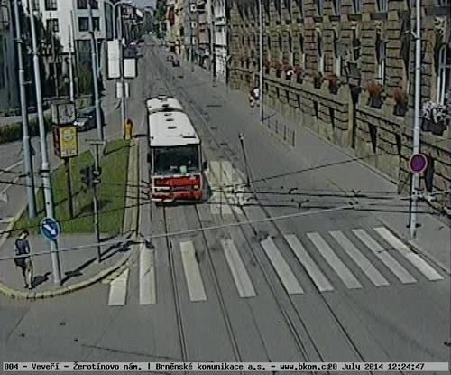

+++
title = 'As I Was Seen'
date = 2014-09-01T16:05:48+01:00
draft = false
tags = ["photography", "surveiallance"]
+++

As I was seen (2014) is a series of 8 auto-portraits with use of traffic cameras around Brno.
With camera refresh rate of 1 shot per minute and 2 to 3 minutes delay before shot is available online the photo shoot quickly turned into a strange public ritual.

