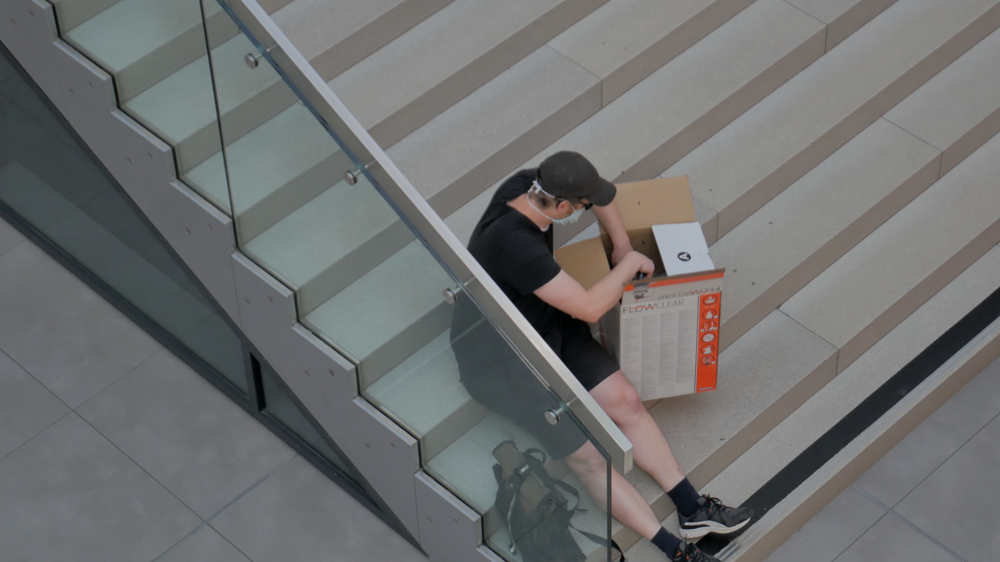

+++
title = 'Black Fly Day'
date = 2020-06-18T16:05:48+01:00
draft = false
tags = ["performance", "intervention"]
description = "Black Fly Day (2020) by Andreas Gajdosik is a disruptive performative intervention into a shopping mall in Ostrava city."
+++
Using industrial waste from material bank provided by PLATO I have created two boxes for cultivation of meat flies in the exhibition space.
Grown-up flies were later released by me in two big shopping malls in the Ostrava city.
Black Fly Day (2020) is an object/intervention created for the exhibition Sand in the Gears in gallery PLATO Ostrava.

<iframe width="560" height="315" src="https://www.youtube.com/embed/aazCogmabVw?si=EK7rBFeV1G3mIwN7" title="YouTube video player" frameborder="0" allow="accelerometer; autoplay; clipboard-write; encrypted-media; gyroscope; picture-in-picture; web-share" referrerpolicy="strict-origin-when-cross-origin" allowfullscreen></iframe>

