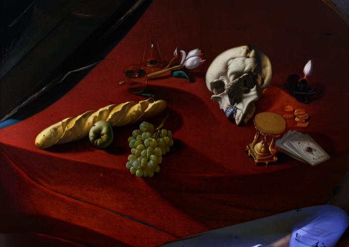
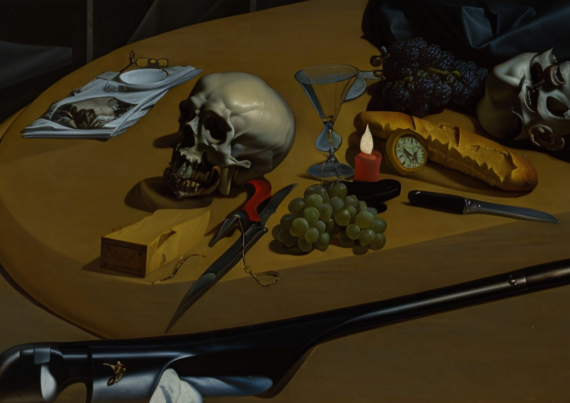

+++
title = 'Caravanitas'
date = 2023-04-04T00:05:48+01:00
draft = false
tags = ["climate change", "3D render", "postcard", "AI", "intervention"]
description = "Series of postcards for the city of Le Mans. It combines the Vanitas genre with the interiors and exteriors of contemporary cars. 3D rendering manipulated by AI."
+++
Caravanitas (2023), a series of tourist postcards created for the city of Le Mans, combines the vanitas genre with the interiors and exteriors of contemporary cars through the technique of 3D rendering manipulated by artificial intelligence.
It is a meditation on the impermanence not only of the individual but also of entire ecosystems in the context of the climate crisis and the city made famous by the 24 Hours of Le Mans car race.
As part of a guerrilla intervention, the postcards were placed at tourist spots within the city for ordinary passers-by to take.

