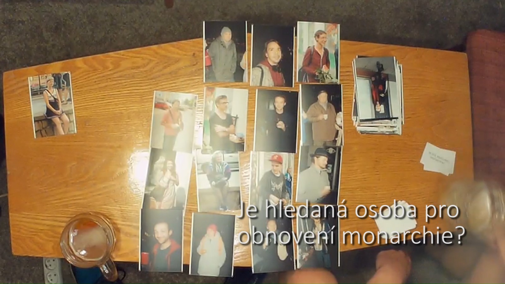
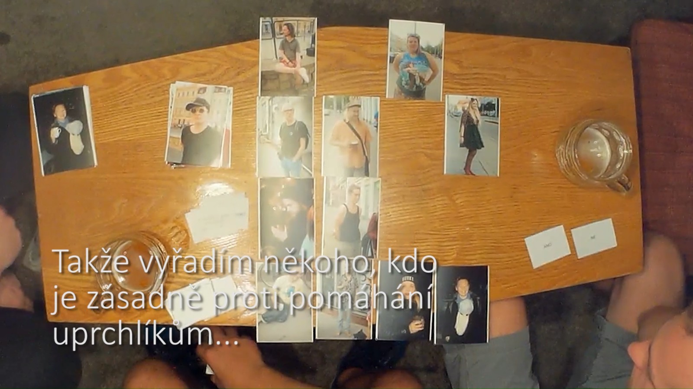
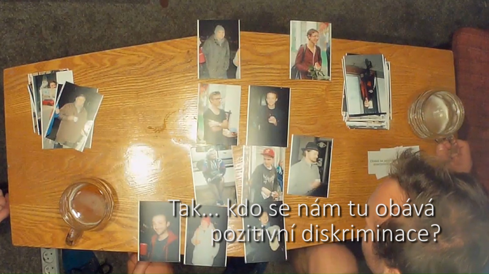
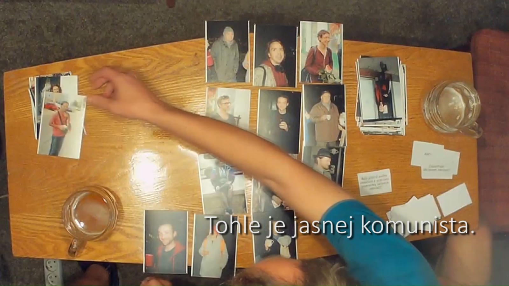
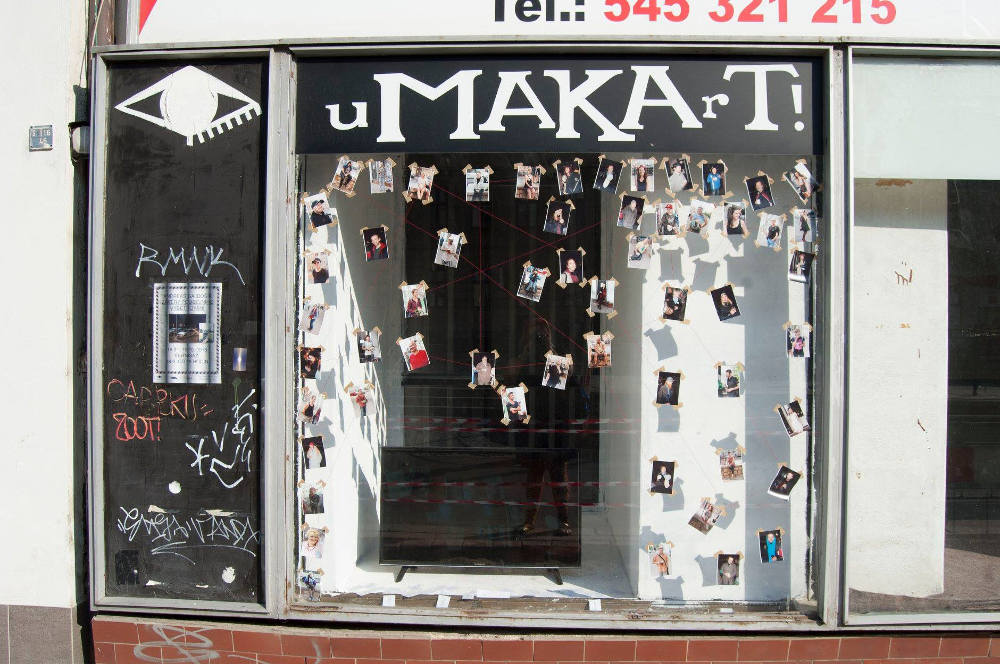

+++
title = 'Conclusions of Police Investigation'
date = 2018-03-01T16:05:48+01:00
draft = false
tags = ["intervention", "video", "prejudice"]
description = "Conclusions of Police Investigation is gallery intervention and video art piece which reveals societal prejudices."
+++
Conclusions of Police Investigation is a site-specific video created for exhibition at gallery Umakart.
In the video two persons are playing a board game Unusual Suspects.
In this game one person is the witness to a crime.
He knows who the culprit is but can only answer “Yes” or “No” to questions about the suspect.
The second person is a detective trying to make sure the right person gets locked up from a line up of twelve hand drawn suspects.
However contrary to original game the version for gallery Umakart consisted of real photo portraits of frequent visitors of the gallery.
And the questions were highly political.
The visitors of the exhibition thus could saw what do the two random strangers think of them.
And thus were directly confronted with prejudice of others.

