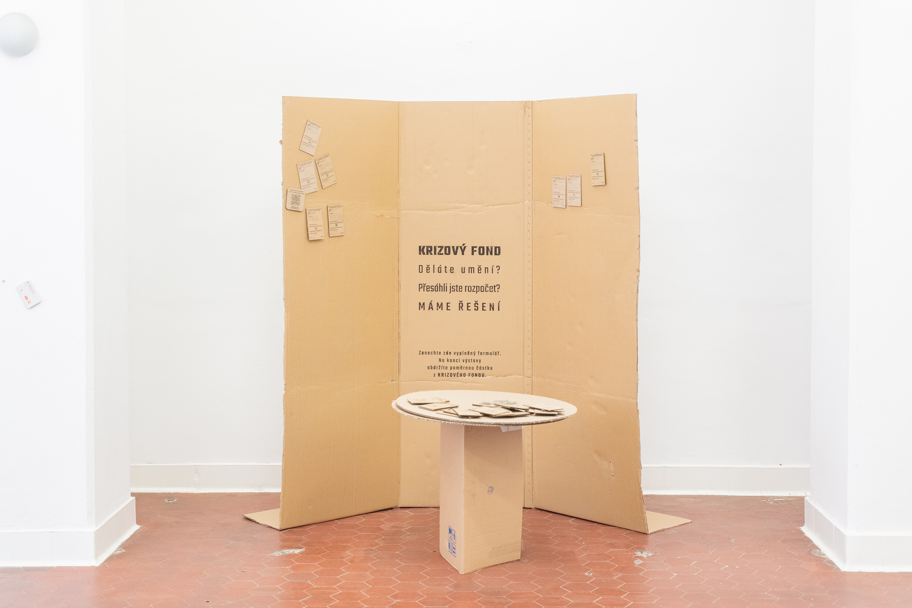
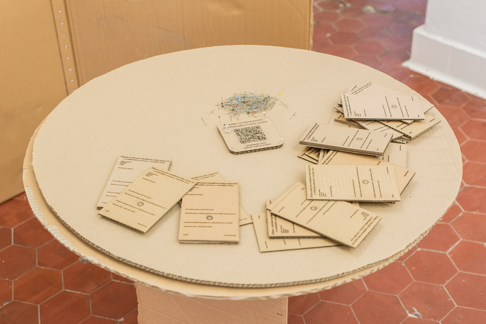
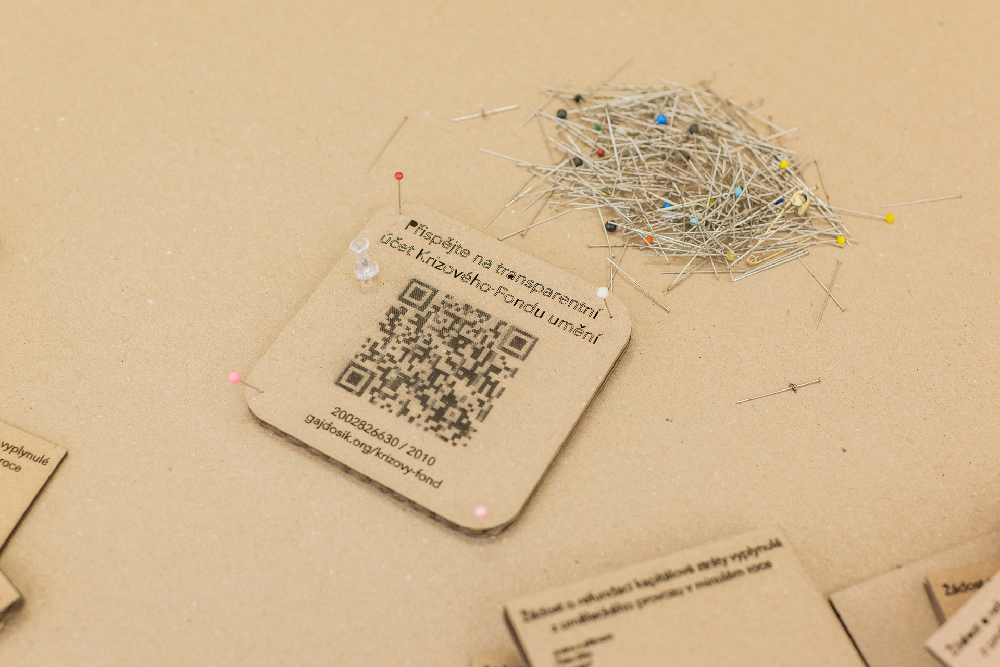
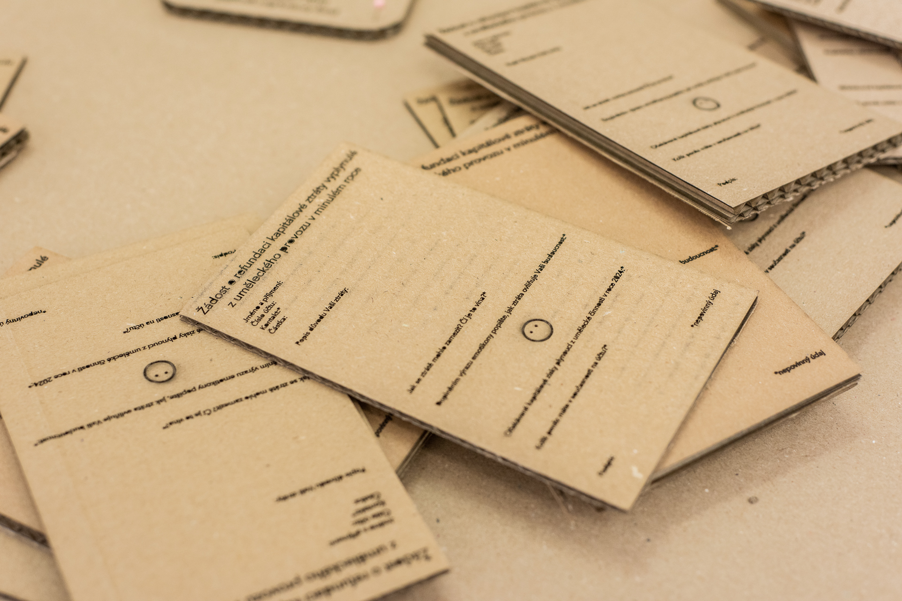
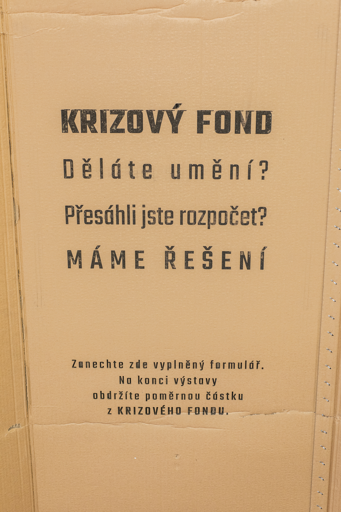
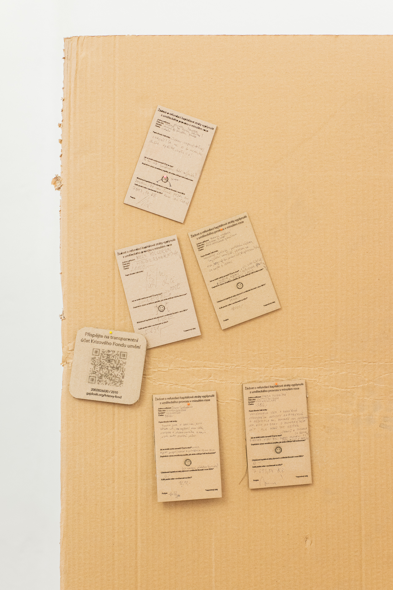

+++
title = 'Crisis Fund'
date = 2024-03-16T12:00:00+01:00
draft = false
tags = ["arte_útil", "institutional_critique"]
+++

'Crisis Fund', in the authorial duo with Jonas Svoboda, is an artwork consisting in minimizing the costs of creating the work and transferring the exhibition budget for the realization of the work to other artists.
Presented as part of the 'Good Job' exhibition, this artwork allows visiting artists to apply for financial assistance to cover expenses such as transportation, materials or fees that were not covered in their own art projects in the previous year.
At the end of the exhibition, budget from this fund is distributed among the applicants, thus promoting and supporting the stability and sustainability of the artistic production in a time of unprecedented inflation and shrinking government spending.

For more information check website of [Crisis Fund](https://gajdosik.org/krizovy-fond/).
You can also check Crisis Fund's [transparent bank account](https://ib.fio.cz/ib/transparent?a=2002826630) to see how the money is being used.

Foto: Tomáš Lumpe
