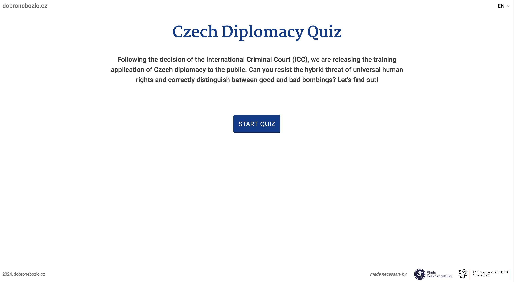
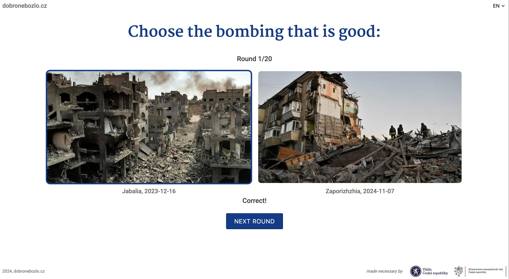
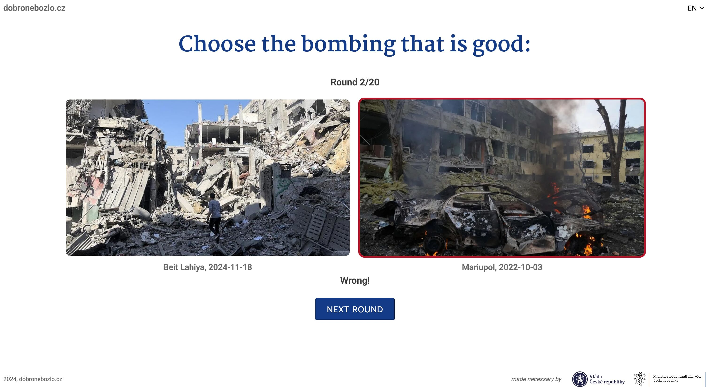
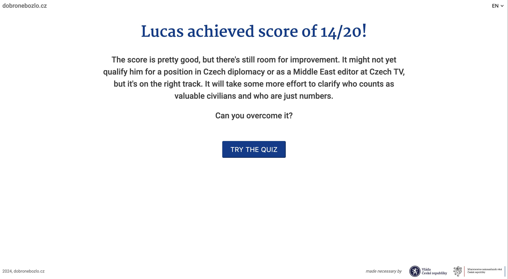

+++
title = 'The Czech Diplomacy Training Course (dobronebozlo.cz)'
date = 2024-11-17T12:00:00+01:00
draft = false
tags = ["radical identification", "internet art", "political art", "webpage"]
description = "Crisis Fund by Andreas Gajdosik and Jonas Svoboda, reallocates exhibition budget to support other artists' costs. This intervention promotes art sustainability amidst economic challenges."
+++

The Czech Diplomacy Training Course (dobronebozlo.cz) is a satirical online web application in which users have to distinguish between good bombing of the civilian population (carried out by the army of a state unconditionally supported by Czech foreign policy) and bad bombing of the civilian population (carried out by the army of an enemy state).

The work satirically responds to the double standard of Czech foreign policy by giving users no choice, in accordance with the Charter of Fundamental Human Rights and the international law of war, to label both bombings as bad.
On the contrary, the quiz forces users to accept a one-sided interpretation of the events in line with the Czech diplomatic stance - it teaches them to see the world through the lens of Czech diplomacy, which in the minimal space of the web application appears unsustainable, absurd, inhumane.

The application is artistically programmed in the TypeScript programming language and the Svelte framework, using additional technologies HTML, CSS and the svelte-i18n localization library.

See the artwork yourself at [dobronebozlo.cz](https://dobronebozlo.cz/?ref=gajdosik.org)! It is available in Czech and English.

