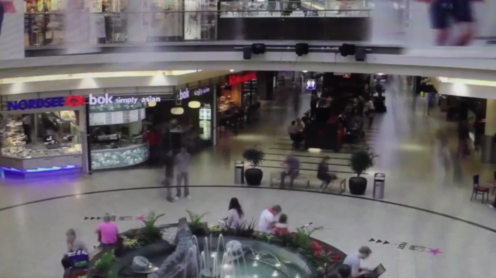
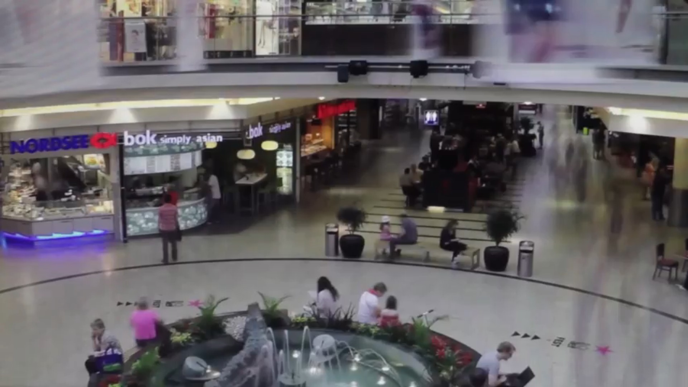

+++
title = 'Dusk /Simulation 1/'
date = 2014-05-01T16:05:48+01:00
draft = false
tags = ["software", "video"]
+++
Dusk /Simulation 1/ is a video of shopping mall interior from which were removed all moving objects.
Without those in hurry the resting and waiting persons, who contradicts the logic of shopping mall are shown and amplified.
The removal was done automatically in real time with custom program written in C++ with library OpenFrameworks.
Original plan was to provide a live stream from shopping mall, but this was refused by its managment.

