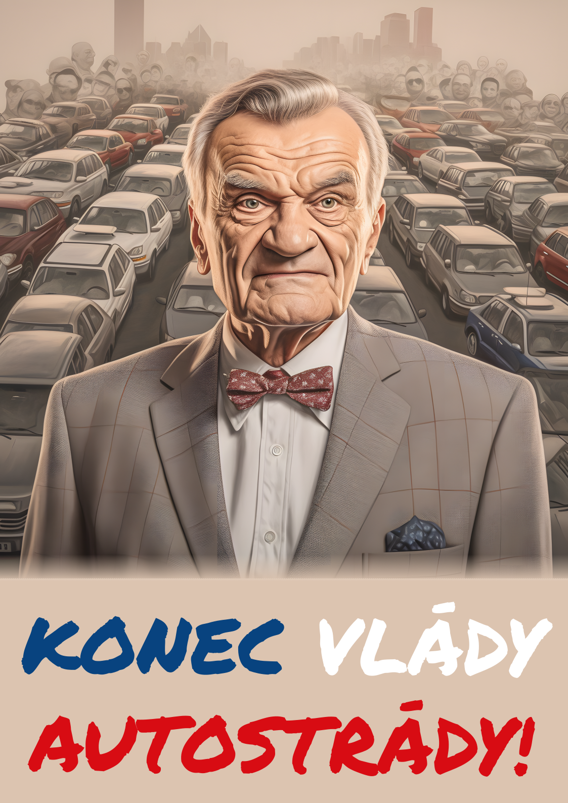
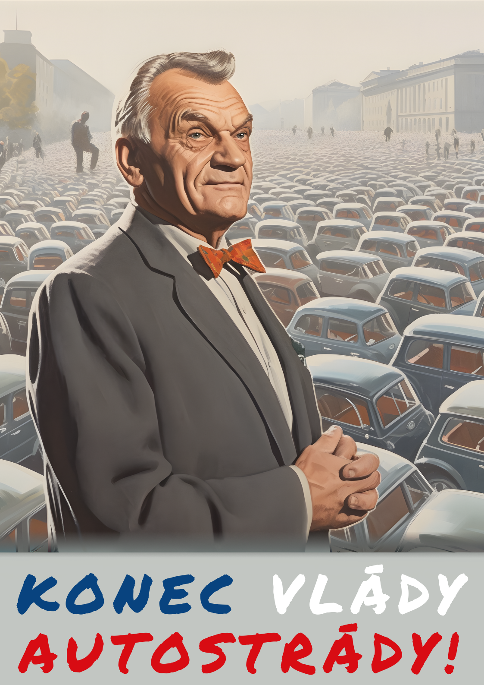
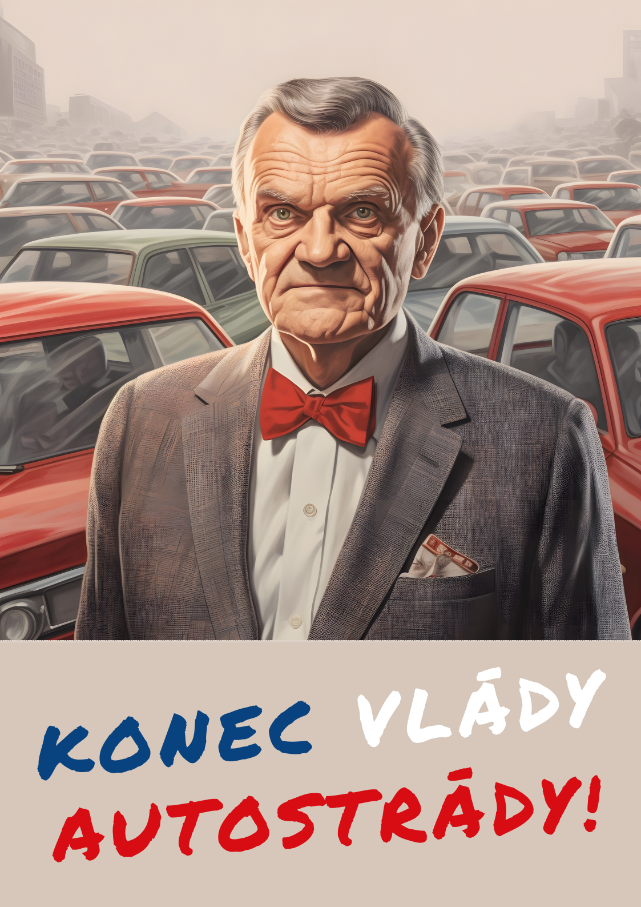
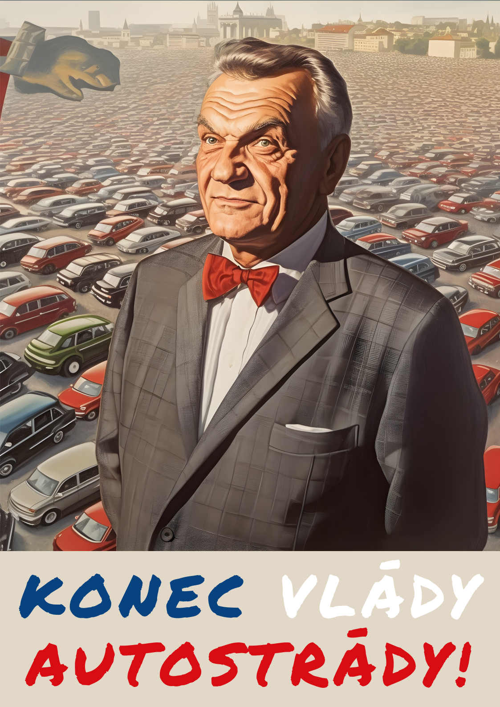
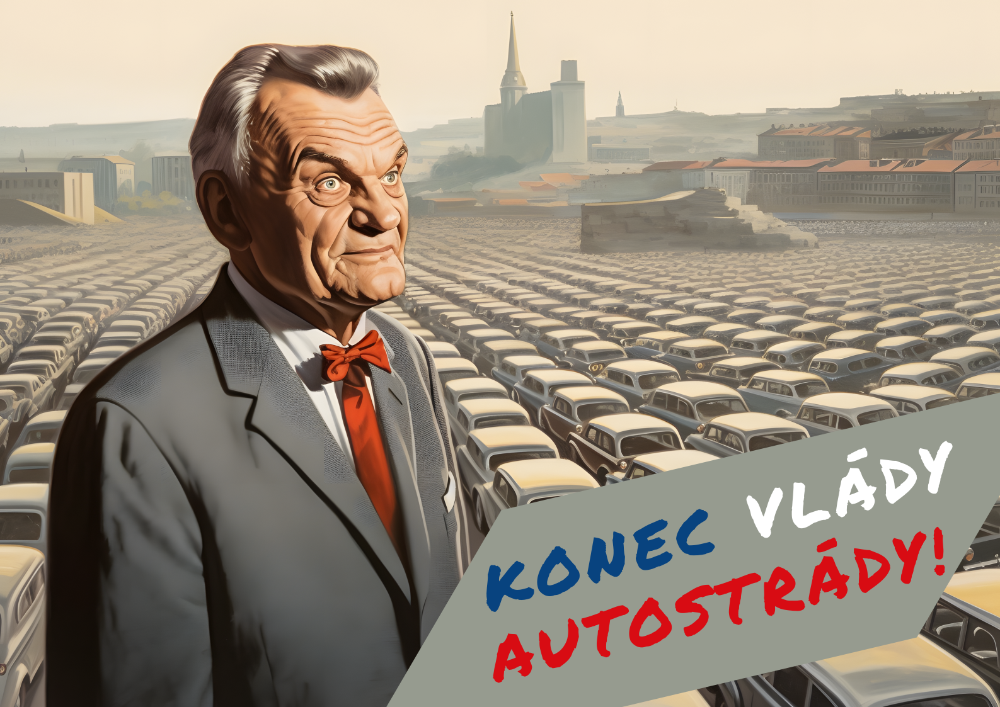

+++
title = 'Konec Vlády Autostrády / The End of the Motorway Rule'
date = 2023-05-10T11:00:00+01:00
draft = false
tags = ["artivism", "ecology", "environment", "Prague", "politics", "transportation", "socialist realism"]
description = "Discover 'Thirty for Prague' posters: Satirical artwork depicting Mayor Svoboda as a communist dictator, advocating against 30km/h speed limit on Prague's Magistrála built by communists."
+++

A series of posters in support of the "Thirty for Prague" movement to limit the speed limit to 30km/h in Prague.
The parody series depicts the Mayor of Prague Bohuslav Svoboda, who is a big fan of car traffic, in the style of socialist realism.
On the posters Svoboda is depicted as a communist dictator standing in front of crowds of cars.

In this artwork Prague's main road "Magistrála", a de facto highway stretching through the city centre, served me as the link between the current right-wing and the communist regime.
Magistrála was built by the communist regime and defended by the current right-wing governments, which vehemently oppose its humanisation.
"The end of motorway rule" (Konec vlády magistrály) is a variation on the pre-revolutionary slogan "The end of one-party rule" (Konec vlády jedné strany).

