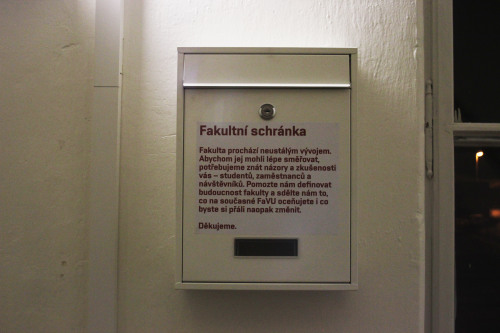
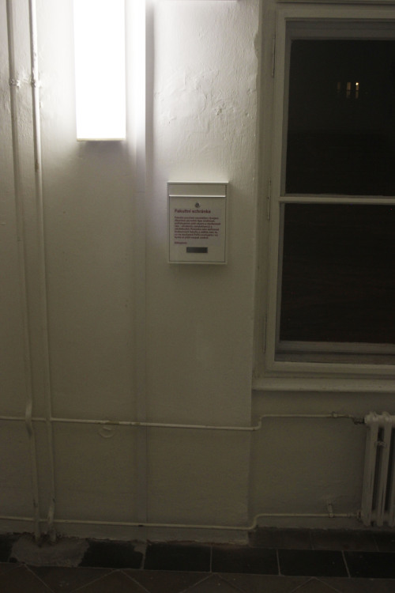

+++
title = 'Mailbox for Feedback'
date = 2018-03-01T16:05:48+01:00
draft = false
tags = ["intervention", "artistic_education", "arte_útil"]
+++
I have installed a mailbox on stairs near main classrooms of Faculty of Fine Arts in Brno.
It asks employees, students and visitors to write down their ideas on what is and what is not working well on the faculty.
Even though the mailbox was installed as a guerilla act the text on it used official language and looked like it was realized by the faculty.
Later I have sent to the Dean a letter containg keys for the mailbox and also stating: ‘I thought it could be useful, so I did it.’
The box is still on its place in 2018, its content is being picked up once a time.

