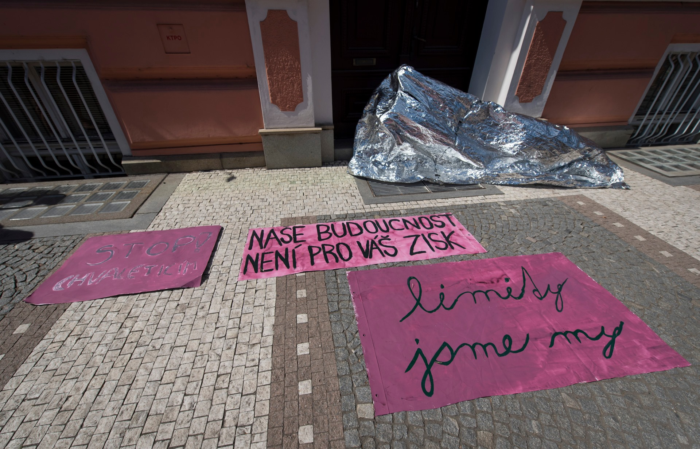

+++
title = 'Rtutík / Mercurie'
date = 2019-08-01T16:05:48+01:00
draft = false
tags = ["performance", "intervention", "artivism", "climate change"]
description = "Uncover the powerful protest performance at Czech Climate Camp 2019, where a mercury droplet in Pardubice highlighted the Chvaletice power plant's emission issues."
+++
In 2019 the Regional Office in Pardubice approved emission exception for Chvaletice power plant.
The exeption allowed the power plant to emit 300 kilograms of mercury over the normal emission limit.
During the action days of czech Climate Camp 2019 I have realized a protest performance in the streets of Pardubice.
Covered in thermofoil I have played huge droplet of mercury flowing through the city and spreading the word about beauties of mercury.

