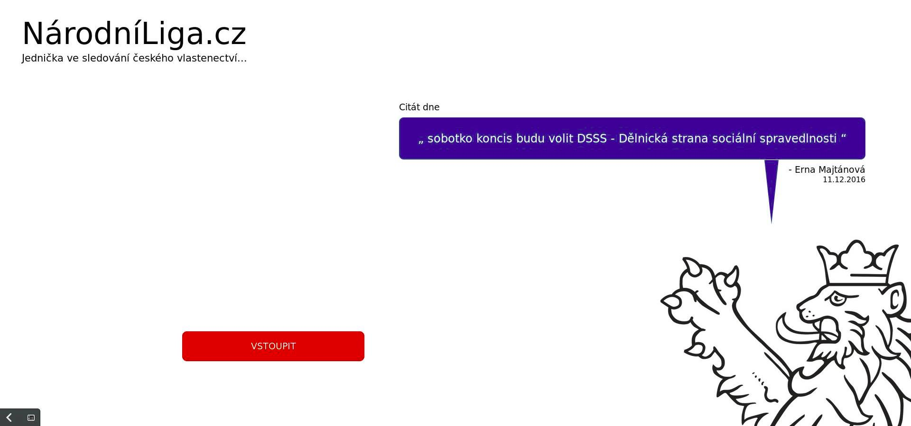
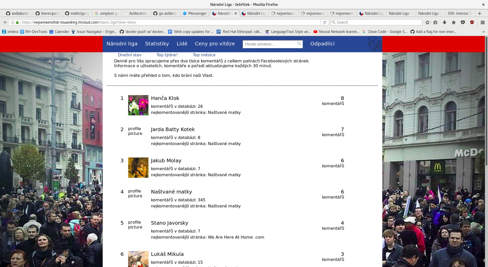
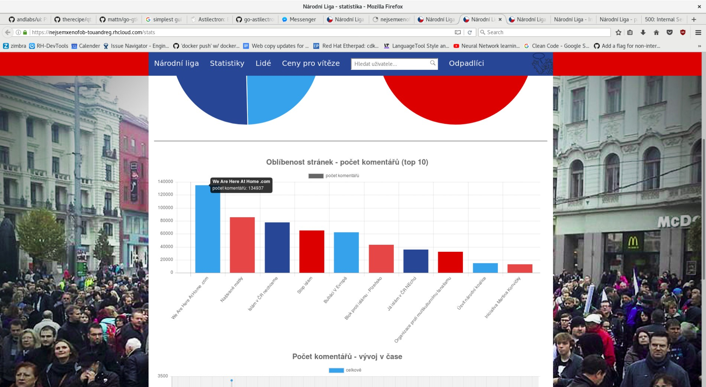

+++
title = 'NarodniLiga.cz'
date = 2016-05-01T16:05:48+01:00
draft = false
tags = ["web", "intervention", "netart", "software", "refugee_crisis", "hatespeech"]
+++
Narodniliga.cz/NationalLeague.cz (2016) is a fake web of czech anti-islamic movement.
It gathers data from Facebook groups which are focused against refugees and islam and makes daily, weekly and monthly rankings.
Those who were commenting most are then winners of the league. 

However what on on first sight looks like a classic right wing web page - colored with tricolora - later gives unpleasant image of czech anti-islamic movement.
The page is full of real comments whose authors sends other people to gas, who wish them drowning in sea, full of vulgarisms etc.
Despite the fact how quite the movement was looking in 2017, hundreds of comments were still produced every day.

