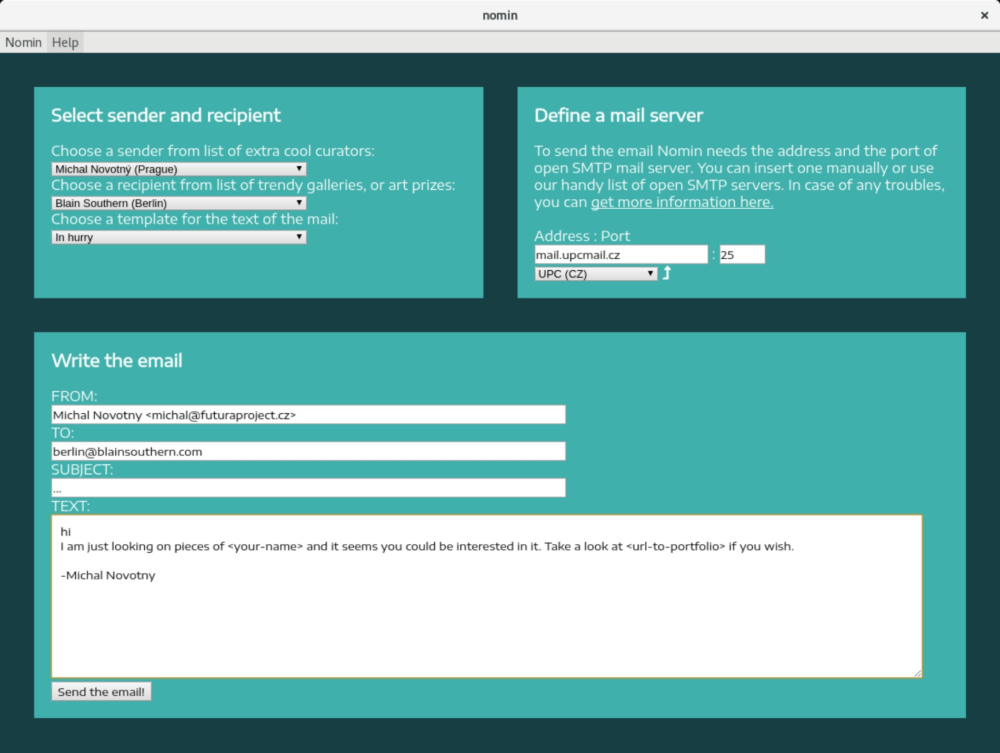
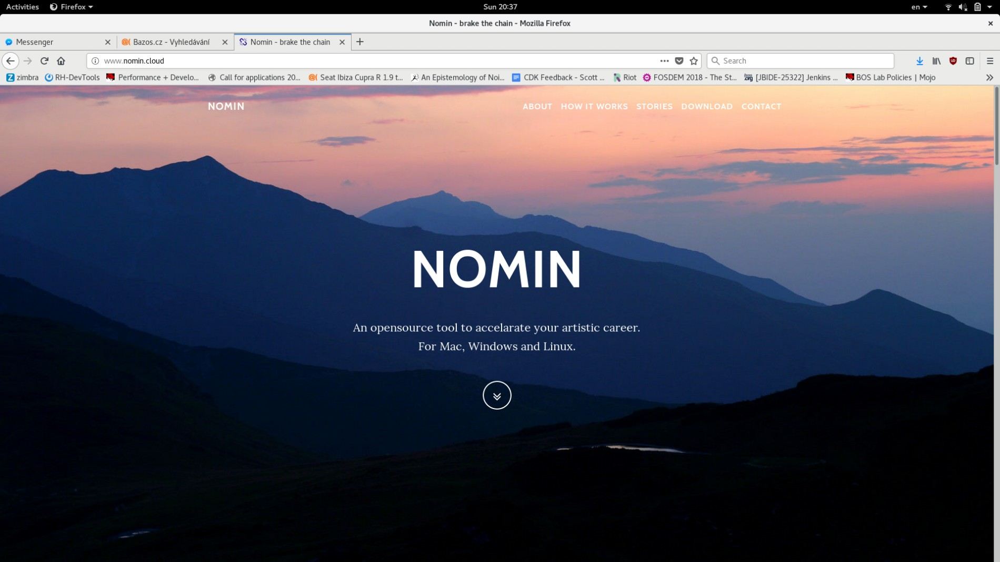
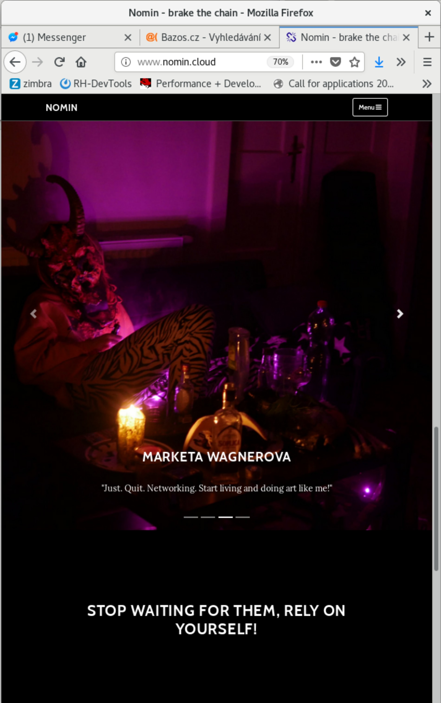

+++
title = 'Nomin'
date = 2018-03-01T16:05:48+01:00
draft = false
tags = ["software", "intervention", "arte_útil"]
+++
Nomin (2017-2018) is project in progress on the edge of software, institutional critique and collective performance.
Its main goal is to help artists from weakened social groups (students, pregnant artists, those who live outside big centers, easterners) with acceleration of their careers.

For this purpose I have created an open source GUI application for Linux, Mac and Windows called Nomin which provides its users the ability of sending fake emails from addresses of famous curators to the mailboxes of selected galleries or other institutions.
Thus the users of Nomin can nominate or reccommend themself from mouths of the gate keepers as if they really were "the lucky ones".
Email may draw an attention of gallery and lead for proposal of exhibition term.
On the other hand if the email is recognized as fake, it may be seen negatively by the gallery.
In this case however the aspect of Nomin as an institutional critique takes place and the failed try has to be understood only as part of an artistic collaborative performance.

Nomin is meant to be an open for collaboration and community friendly project.
Its source code, documentation and latest releases live on link:https://github.com/nomin-project/nomin[github.com/nomin-project/nomin], where bugs, questions or feature requests can be submitted.
More information about Nomin is also available on its site link:https://www.nomin.cloud[www.nomin.cloud].
Several workshops for students and an exhibition "Do It Yourself" at Faculty of Art and Design in Usti nad Labem was held as part of the Nomin project.

