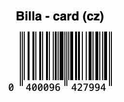

+++
title = 'NoneCard'
date = 2025-03-04T00:05:48+01:00
draft = false
tags = ["obfuscation", "arte útil", "surveillance capitalism", "webpage", "identity mixing"]
description = "An internet art application for sharing customer cards. Nonsense to the companies, value to the people!"
+++
NoneCard (2025) is an internet art application for sharing customer cards.
An artist, his friends, and random people on the internet share and use these customer cards to obtain discounts while keeping their data obfuscated.
As a result of this "identity mixing," a shared data identity is created in the databases of shops and corporations, and a digital subject that is completely misleading and worthless is generated.
The application is available at https://nonecard.gajdosik.org.

Anyone on the internet can view the cards that have been added to the database and thus take advantage of “club” or customer discounts without compromising their digital footprint.
At the same time, anyone can share their user cards and thereby obfuscate their existing digital footprint.

The project is open source and can be replicated in other geopolitical contexts by other groups or individuals.
At the same time, however, it is possible to contact the administrators to request new features, which are gradually added based on user feedback as well as on the types of cards, the countries they come from, and the number of cards uploaded.

In accordance with permacomputing principles, the project’s visual design is intentionally kept in an extremely minimalist “smolweb” style to conserve user data and computing power.
