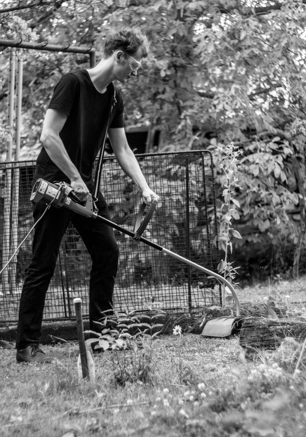
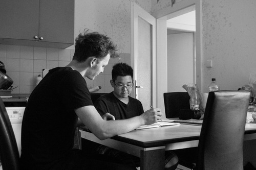

+++
title = 'One Hour of Work'
date = 2014-05-01T16:05:48+01:00
draft = false
tags = ["photography", "performance", "capital"]
+++

One Hour of Work (2014) is series of 3 photographs.
The photographs do not only refer working author or his graphical card on visual basis but also on capitalist level: earned money were used for printing of the actual pictures.
Thus the more earning work, the bigger photography.

