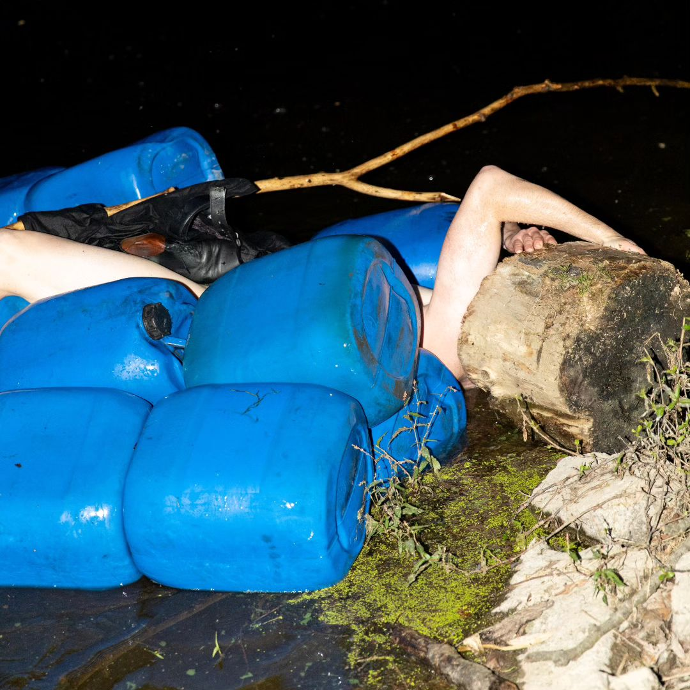

+++
title = 'The Raft of the Frogman'
date = 2023-09-11T16:05:48+01:00
draft = false
tags = ["performance", "climate change", "ecology"]
description = "The Raft of the Frogman is an ecological and grotesque performance where an IT worker, symbolized as Mr. Froggie, faces the dark reality of unlimited production on their vacation on a warming lake."
+++

Performance as an interface between IT worker, frog in a pot, grotesque and ecological tragedy.

I created a floating monument of recycling out of waste plastic containers for motor oil as a solution for unlimited production.
Dressed in normcore clothing, I then took to the water to celebrate the triumph of man over the impact of man with three victorious frog leaps.
Then it got ugly.

Vacation on a warming lake turned into a nightmare for the unaware ICT worker, Mr Froggie (1-99).

Photo: [Lukáš Hlavín](https://www.instagram.com/lukonano/)
