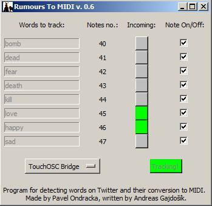

+++
title = 'Rumours to MIDI'
date = 2015-09-01T16:05:48+01:00
draft = false
tags = ["software", "data", "music"]
+++
Rumours to MIDI (2015) is a custom program written in Python.
It scans Twitter for selected words and in real time it generates MIDI notes.
Thus it can be used to produce strange rhytms or melodies from information all around the world.

