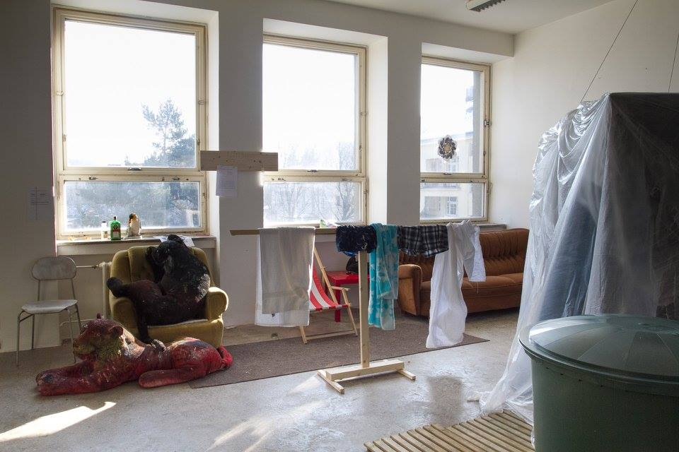
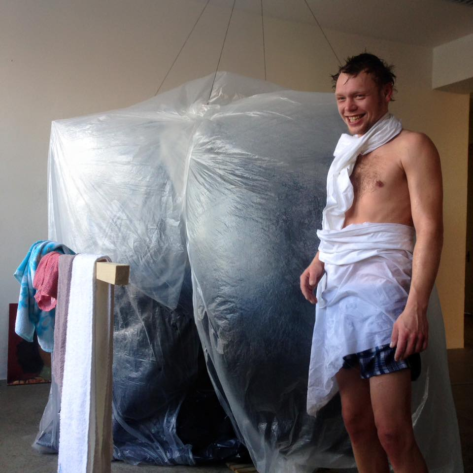

+++
title = 'Sauna / What Dean Promised I am Doing'
date = 2017-01-01T16:05:48+01:00
draft = false
tags = ["installation", "intervention", "happening", "institutional_critique"]
description = "Art intervention Sauna (2017) is a satirical fulfillment of a dean's unkept promise with a temporary, freely accessible sauna at the Faculty of Fine Arts, available to all in early 2017."
+++
As part of pre-election promises for both terms the current dean of Faculty of Fine Arts promised a school sauna for students and employees of faculty.
However this populist promise was never realized.
To react I took his promise seriously and tried my best…
Sauna was operating from January 2017 to March 2017, freely open to all students, employees and visitors of faculty.

