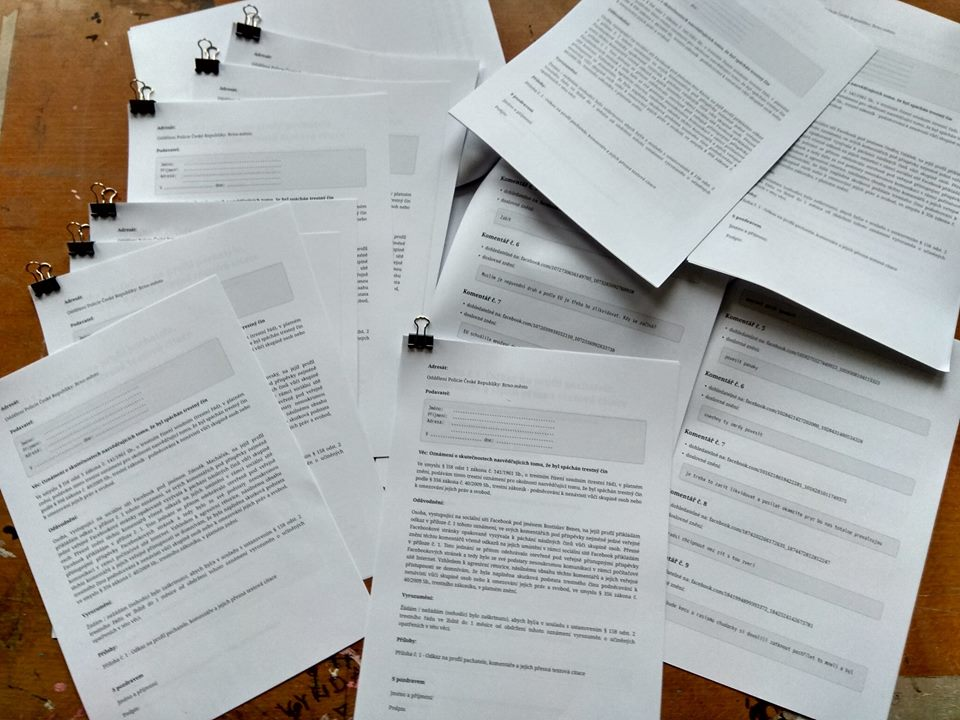
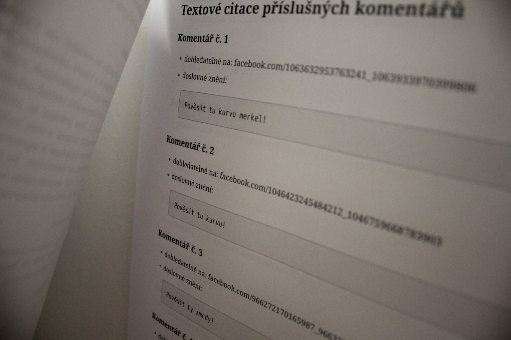
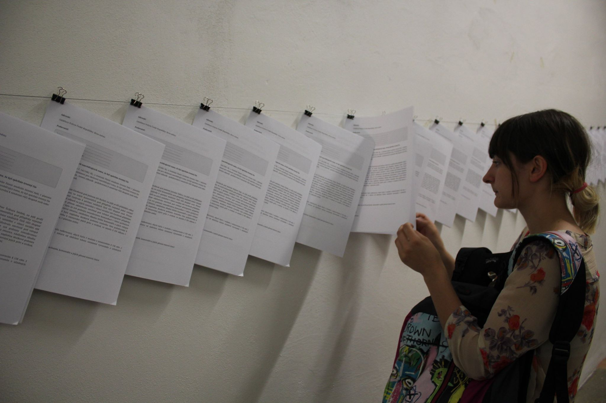
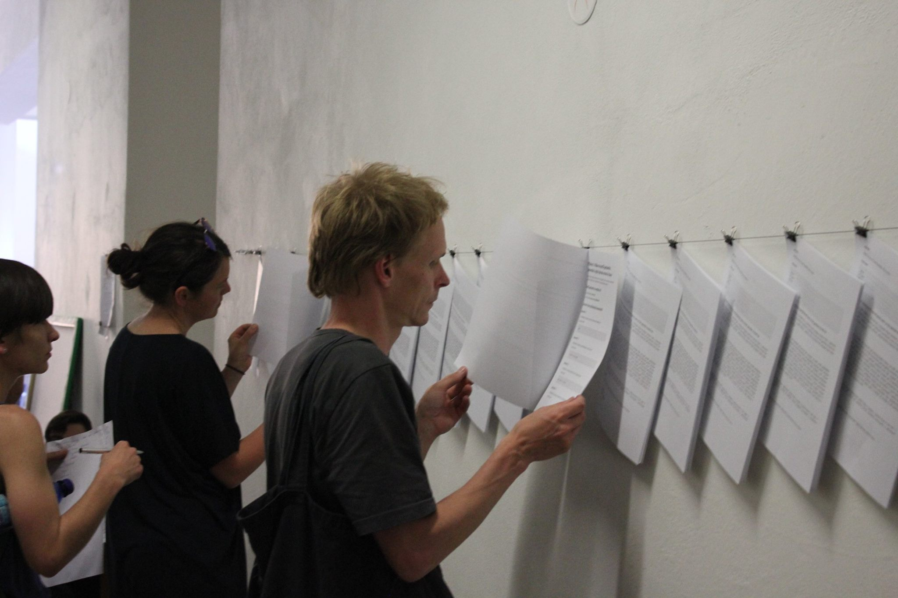
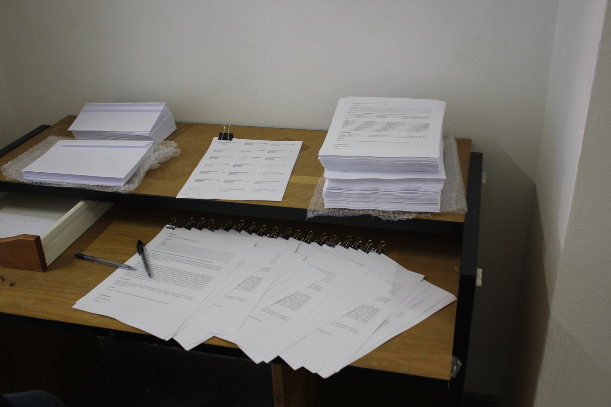
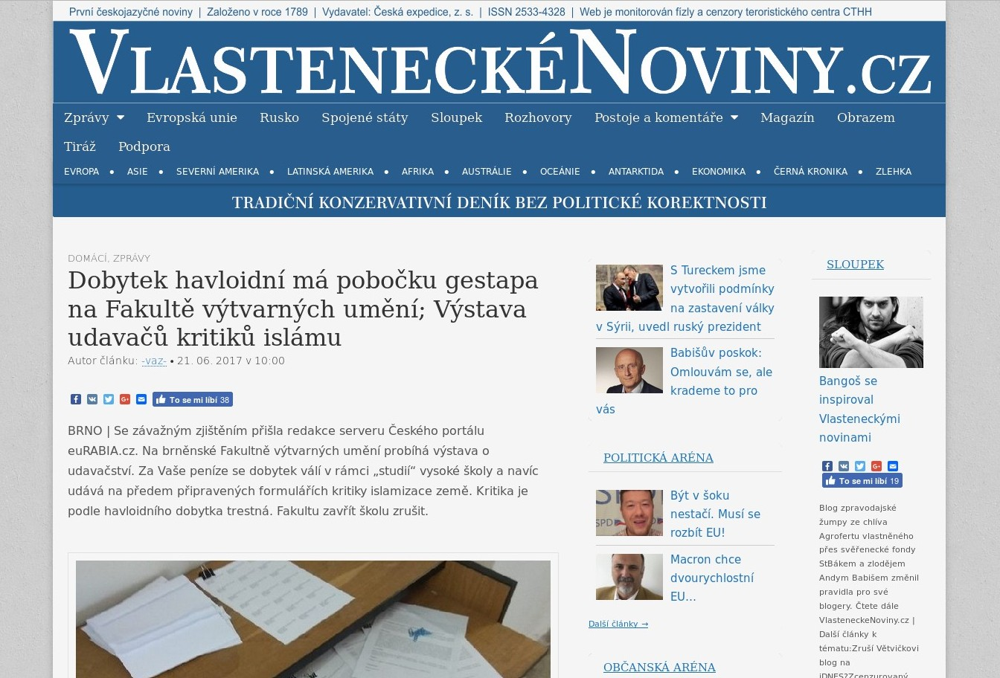
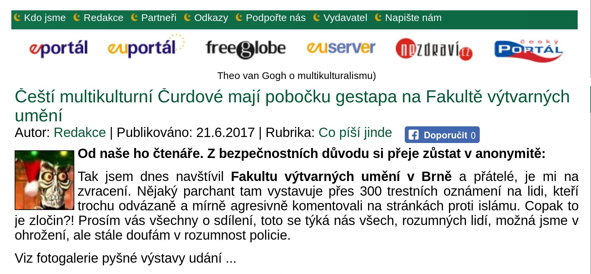
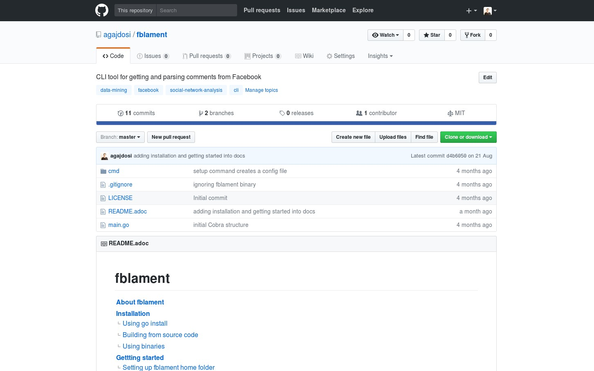

+++
title = 'Take Away'
date = 2017-05-01T16:05:48+01:00
draft = false
tags = ["software", "data mining", "hacktivism", "refugee crisis", "hatespeech", "social network"]
description = "Take Away (2017) is a provocative gallery project on the edge of software art and collective performance. It features 330 criminal complaints against hate speech on far-right Facebook pages. Engage with ethical dilemmas and societal defense."
+++
Take Away (2017) is a gallery project which consisted of 330 criminal complaints for incitement of hatred.
Criminal complaints were automatically generated with all needed legal reasoning and filled with names and actual citations of users who aggressively commented on anti-islamic or other far-right Facebook pages.
The visitors could freely search and read through the complaints and take whichever they want, however they were not directly asked in any way to submit them.

Some visitors understood this project as a symbolic gesture or as a possibility to get some insight into czech extremistic scene.
Some of them however when they were confronted with hundreds of dangerous and/or completely disgusting comments choosed to submit the complaint to the police.
The project played with the nuances in personal responsibility and the ethical aspects of surveillance.
What felt as spying for ones was defense of democratic society for the others.

Code for this project was written by me as a part of the work.
Its generalized form designated for easy public use is open-sourced and can be downloaded from github.com/agajdosi/fblament.
This code does not contain original pages which were searched nor the template text of the criminal complaints, but can be used for mining of social networks and as a basis for creating a similar end project as Take Away.

