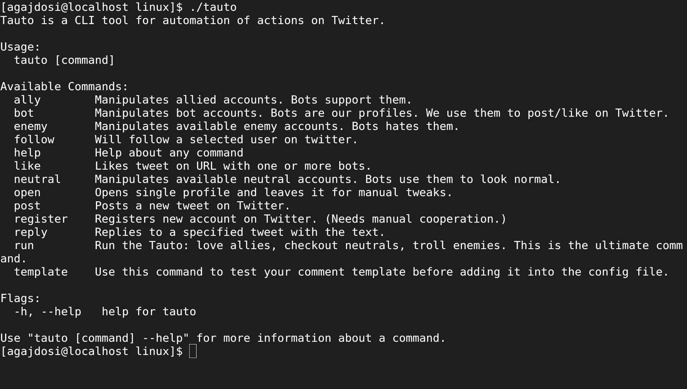
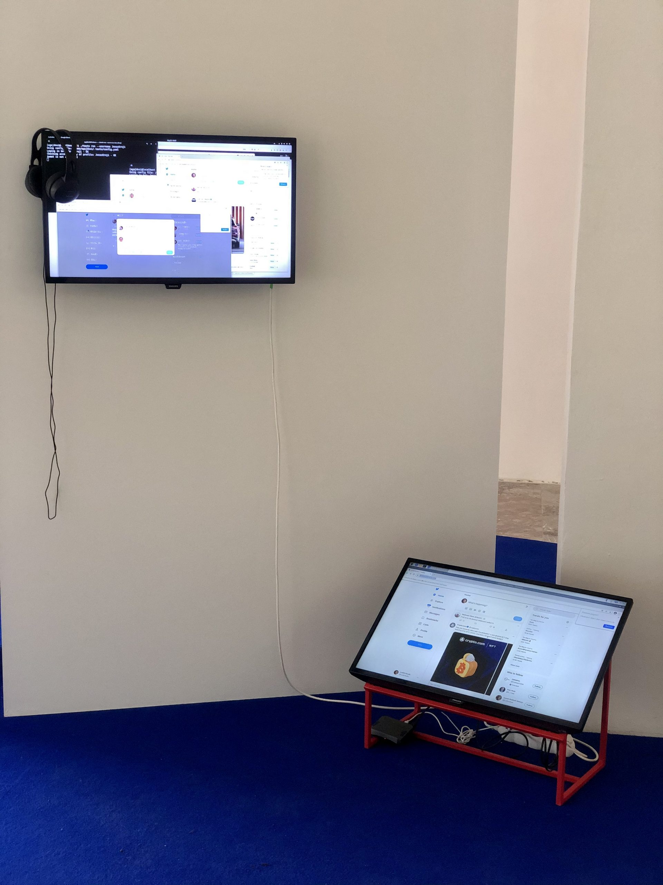

+++
title = 'Tauto'
date = 2021-06-01T16:05:48+01:00
draft = false
tags = ["software", "intervention", "social_network", "artivism", "bots"]
+++
Tauto is artistic software for activists and anybody else which allows to spread comments on Twitter.
It is a command line tool to automate interactions of bot accounts on Twitter via Twitter's graphical user interface (website in browser).
Tauto is thus capable of interactions which are not available through Twitter API or which could be blocked if used in high volumes via API.
Exploring the space of evil media it is a sarcastic comment on bot farms, but also a useful piece of software. 
In accordance with ideas of Arte Útil movement Tauto is functional and can be used to counter the forces of hybrid propaganda by its own means: spreading whatever its user wants.

