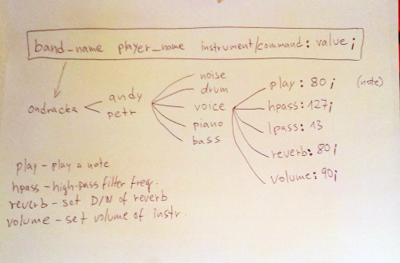
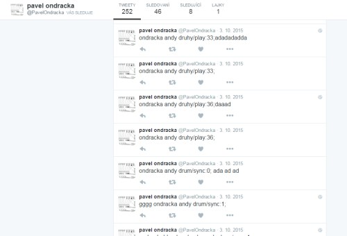
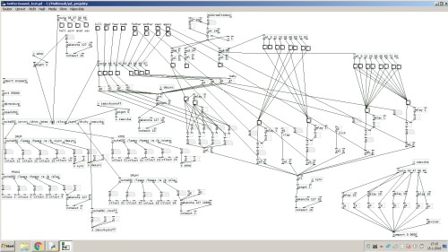

+++
title = 'Tweet Coding Performances'
date = 2013-03-01T16:05:48+01:00
draft = false
tags = ["music", "software", "data_mining"]
+++
Performances with group Pavel Ondracka which used data from Twitter to change parameters of sound synthesizers.
Through prepared system of commands every spectator could change the musical output.

